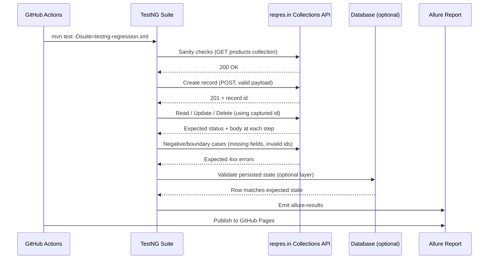

# QA API Automation Framework

A REST API test automation suite built with **Java, RestAssured, and TestNG**,
running as an automated regression gate in CI (GitHub Actions) with a live
Allure report published on every run.

Targets reqres.in's **Collections API** (`/api/collections/products/records`)
by default — their classic `/api/users` demo endpoints are now gated behind
a paid tier, so this suite was pointed at the free-tier resource instead
(a real mid-project pivot, not a planning mistake — see "A note on this
pivot" below). Swap `base.url` in `config.properties` (or set a `BASE_URL`
env var) to point it at any REST service, including a private one deployed
on Render/Railway.

## A note on this pivot

The first version of this suite targeted reqres.in's legacy `/api/users`
endpoints. Those started returning `403 Forbidden` mid-build — the provider
had changed its free-tier scope without a version bump. Rather than assume
the test code was wrong, the fix here was to re-verify against the
provider's own OpenAPI spec (`reqres.in/openapi.json`), confirm the actual
free-tier resource (a per-project "Collections" API), and rewrite the suite
against it. That diagnostic path — reproduce, don't assume, check the
source of truth, adjust — is the same one you'd walk through with a real
API that changed under you mid-sprint.

## Live regression report
`https://<your-github-username>.github.io/qa-api-automation-framework/`
*(populates automatically after your first successful CI run — see setup below)*

## What this demonstrates

| Requirement | Where |
|---|---|
| Sanity / Functional / Regression testing | `SanityTests.java`, `FunctionalTests.java`, grouped via `testng-*.xml` |
| API testing & REST service automation | RestAssured-based suite across CRUD endpoints |
| SDLC / STLC process | Test plan → test design → execution → defect logging (`DEFECTS.md`) |
| SQL concepts | `postgresql` JDBC dependency wired in for DB-state assertions once pointed at a real service with a DB |
| SCRUM / CI regression gate | `.github/workflows/qa-pipeline.yml` runs the regression suite on every push |
| Test management / reporting | Allure reports (severity, epics, features) published to GitHub Pages |
| UML / system understanding | Sequence diagram below |

## Test flow (sequence diagram)



## Project structure

```
src/test/java/com/nikhil/qa/
  base/BaseTest.java          shared RestAssured setup, env-driven base URL
  utils/ConfigReader.java     reads config.properties, allows CI override
  tests/SanityTests.java      fast smoke checks — run first, every build
  tests/FunctionalTests.java  positive-path CRUD coverage, tagged for regression
  tests/NegativeTests.java    invalid input / boundary value coverage
testng-sanity.xml             quick suite for fast feedback
testng-regression.xml         full suite, parallelized, used by CI
DEFECTS.md                    defect log in standard STLC format
.github/workflows/            CI pipeline: test → Allure report → GitHub Pages
```

## Running locally

```bash
git clone <your-repo-url>
cd qa-api-automation-framework

# Sanity suite (fast)
mvn test -Dsuite=testng-sanity.xml

# Full regression suite
mvn test -Dsuite=testng-regression.xml

# Point at a different environment without touching code
BASE_URL=https://your-api.onrender.com/api mvn test -Dsuite=testng-regression.xml
```

## Setup checklist (GitHub Actions + free Pages hosting)

1. Push this repo to GitHub.
2. In repo **Settings → Pages**, set source to the `gh-pages` branch (created
   automatically after your first workflow run).
3. In repo **Settings → Actions → General**, ensure "Read and write
   permissions" is enabled for the `GITHUB_TOKEN` (needed to publish to
   `gh-pages`).
4. Push to `main` — the pipeline runs automatically. Check the **Actions**
   tab for progress, then visit the Pages URL above for the live report.

## Next step (before the interview)

Point `base.url` at your own Credit Risk API deployment, seed 1-2 real
defects into the risk engine, and fill in `DEFECTS.md` with the real
reproduction steps and root cause. That turns this from a demo into a
concrete story you can walk an interviewer through end-to-end.
